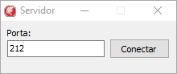
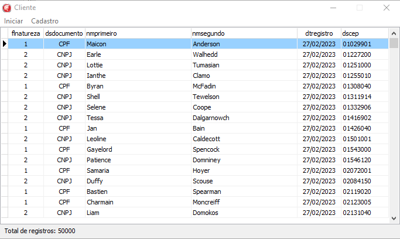

<h1 align="center">    
    
DataSnapWithFireDac

    
          
    
</h1>

## Índice
- [Sobre](#-sobre)
- [Feramentas](#-ferramentas)
- [Funcionalidades](#-funcionalidades)
- [Licença](#-licença)

## 📘 Sobre

**Prova Delphi WK Techonology**. O objetivo é fazer um cadastro simplificado de pessoas, com os dados da pessoa (tabela “pessoa”) e o CEP (tabela “endereco”). Este cadastro deverá ser feito na aplicação Destktop, consumindo os endpoint disponibilizados pela aplicação REST.

## 🛠 Ferramentas

- [Delphi XE7](https://www.embarcadero.com/br/)
- [Postgre](https://www.postgresql.org/)
- [Git](https://git-scm.com/)
- [Tortoise Git](https://tortoisegit.org/)
- [Visual Studio Code](https://code.visualstudio.com/)

## 💡 Funcionalidades

- **Aplicação Servidor**: Para realizar os testes, é necessário executar a aplicação **Servidor** na porta desejada, para que a aplicação **Cliente** possa consumir os seguintes endpoints: **Insert**, **Update**, **Delete** e **Cadastrar em Lote**.

- **Aplicação Cliente**: Com a aplicação **Servidor** em execução, basta clicar no menu **Iniciar > Conexão** e conectar a aplicação **Cliente** à aplicação **Servidor** e consumir os métodos já mencionados. **OBS.:** Escolher a mesma porta usada na aplicação **Servidor**.

- **Cadastrar em Lote**: Será carregado o arquivo **lista-pessoas.csv** em memória e após isso, será inserido um total de **50 mil registros** na base de dados. Aqui foi utilizado o conceito de **FireDAC Array DML** para ser mais performático que a maneira tradicional. Vale ressaltar também que, foi necessário a inserção em lotes devido que o **Postgre** dava erro ao tentar inserir mais de **20 mil registros** de uma só vez.

- **Inserir**: Opção para incluir um registro manualmente utilizando o endpoint **Insert**.

- **Editar**: Opção para editar um registro manualmente utilizando o endpoint **Update**.

- **Deletar**: Opção para deletar um registro manualmente utilizando o endpoint **Delete**.

## 📄 Licença

Esse software é **free** e foi construído para realizar a **Prova Delphi WK Techonology**.